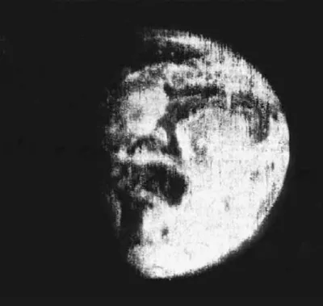

# Low Resolution Egregores

This is the very first image ever taken of the whole earth. 

> The first crude television image of the distant Earth as a planet in space was made by a Soviet weather satellite on May 30, 1966. 68K

This is about the same resolution we currently have of humanity. We have a planetary communication network and a global stage that we're all watching, but we can't see much at all in it. We can't see the details, we can't see how it's changing.

We can't see how _we're_ changing it.

Sources:

- [http://www.donaldedavis.com/2003NEW/NEWSTUFF/DDEARTH.html](http://www.donaldedavis.com/2003NEW/NEWSTUFF/DDEARTH.html)
- [https://space.stackexchange.com/a/32424](https://space.stackexchange.com/a/32424)